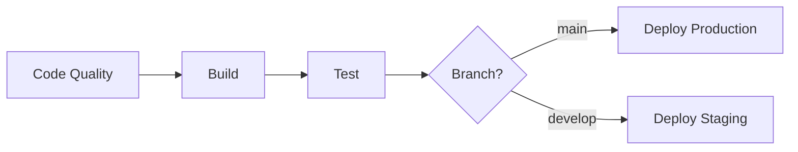

# CI/CD Pipeline Configuration

## Overview
This repository uses GitHub Actions for automated CI/CD with the following stages:

## Pipeline Stages

### 🎨 1. Code Quality & Security
- **Code formatting checks** using `dotnet format`
- **Security vulnerability scanning** for NuGet packages
- **Dependency analysis**

### 🏗️ 2. Build
- **Multi-layer caching** for faster builds
- **Release configuration** build
- **Artifact publishing** for deployment
- **Build artifact retention**: 7 days

### 🧪 3. Test & Coverage
- **Unit tests** execution
- **Code coverage** collection with XPlat
- **Test result reports** (TRX format)
- **Test artifact retention**: 7 days

### 🚀 4. Deploy to Production
- **Environment**: Production
- **Triggered on**: Push to `main` branch
- **Platform**: Render
- **Includes**: Health checks and deployment verification
- **Protected**: Requires all previous jobs to pass

### 🧪 5. Deploy to Staging (Optional)
- **Environment**: Staging
- **Triggered on**: Push to `develop` branch
- **Platform**: Render Staging

## Required GitHub Secrets

Add these secrets in **Settings → Secrets and variables → Actions**:

| Secret Name | Description | Required For |
|-------------|-------------|--------------|
| `RENDER_DEPLOY_HOOK_URL` | Render production deploy hook | Production deployment |
| `RENDER_STAGING_DEPLOY_HOOK_URL` | Render staging deploy hook | Staging deployment (optional) |

## How to Get Deploy Hook URLs

### Render Deploy Hook:
1. Go to your Render dashboard
2. Select your service
3. Go to **Settings** → **Deploy Hook**
4. Copy the webhook URL
5. Add it to GitHub Secrets as `RENDER_DEPLOY_HOOK_URL`

## Workflow Triggers

- **Push** to `main` or `develop` branches
- **Pull requests** to `main` branch
- **Manual dispatch** via GitHub Actions UI

## Pipeline Flow



## Environment Protection Rules

### Production
- ✅ Requires all checks to pass
- ✅ Requires review from maintainers (recommended)
- ✅ Only deploys from `main` branch

### Staging
- ✅ Requires all checks to pass
- ✅ Deploys from `develop` branch

## Monitoring & Notifications

- **GitHub Summary**: Each job posts a detailed summary
- **Job Status**: Real-time status updates
- **Artifact Uploads**: Build and test artifacts automatically uploaded

## Best Practices Implemented

✅ **Caching**: NuGet package caching for 50% faster builds  
✅ **Parallel Jobs**: Independent jobs run in parallel  
✅ **Fail Fast**: Pipeline stops on critical failures  
✅ **Security**: Automated vulnerability scanning  
✅ **Code Quality**: Format and lint checks  
✅ **Artifact Management**: 7-day retention for debugging  
✅ **Environment Separation**: Staging and Production environments  
✅ **Health Checks**: Post-deployment verification  

## Manual Deployment

To manually trigger deployment:
1. Go to **Actions** tab
2. Select **CI/CD Pipeline**
3. Click **Run workflow**
4. Choose the branch and click **Run workflow**

## Troubleshooting

### Build Fails
- Check the **Build Summary** in job output
- Review compiler errors and warnings
- Verify NuGet package compatibility

### Tests Fail
- Review **Test Summary** and uploaded test results
- Download test artifacts from the job
- Check test logs for specific failures

### Deployment Fails
- Verify `RENDER_DEPLOY_HOOK_URL` is set correctly
- Check Render dashboard for deployment logs
- Ensure health check endpoint is accessible

## Local Testing

Before pushing, test locally:

```bash
# Restore dependencies
dotnet restore

# Code formatting check
dotnet format --verify-no-changes

# Security scan
dotnet list package --vulnerable

# Build
dotnet build --configuration Release

# Run tests
dotnet test --configuration Release

# Publish
dotnet publish SWD.API/SWD.API.csproj --configuration Release
```

## Support

For issues with the CI/CD pipeline:
1. Check job logs in GitHub Actions
2. Review this documentation
3. Contact the DevOps team
